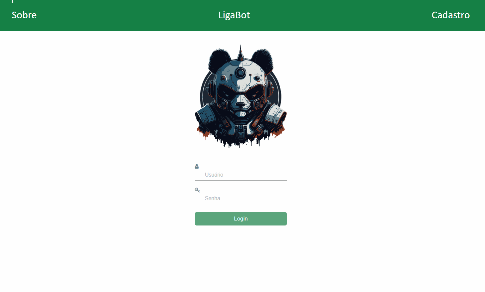

# Sistema de cadastro e modificação de usuários

## Visão Geral

Este projeto está em desenvolvimento e atualmente foca no desenvolvimento do frontend. Consiste em três telas principais:

1. **Tela inicial/Login**: Permite que os usuários autentiquem-se no sistema.
2. **Sobre**: Fornece uma descrição do objetivo e propósito do projeto.
3. **Cadastro**: Solicita informações de usuário, senha e email para registro.

O objetivo final é criar um sistema completo que permita o gerenciamento eficiente de dados de usuários, utilizando tecnologias como HTML, CSS, JavaScript, PHP e MySQL.

## Funcionalidades Futuras (A serem Implementadas)

- Backend para processamento e armazenamento de dados.
- Funcionalidades de autenticação e autorização.
- Integração com banco de dados SQL para persistência de informações de usuários.

## Como Testar

1. Clone o repositório para sua máquina local.
2. Abra os arquivos HTML no seu navegador web para interagir com as telas existentes.

**Observação:** O backend e a funcionalidade completa do sistema estão em desenvolvimento e serão adicionados posteriormente.

## Contribuições

Contribuições são bem-vindas! Sinta-se à vontade para abrir issues ou pull requests.
