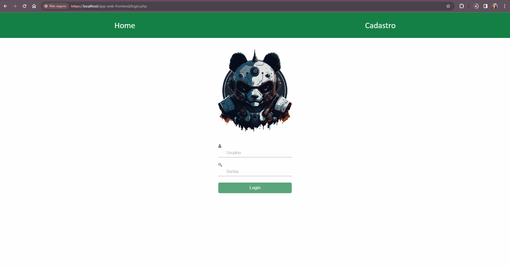

# Sistema de cadastro de usuário

Desenvolvido in vanilla mode, este sistema foi projetado para permitir o cadastro, o login e a adição de informações do usuário diretamente no banco MySQL. *

Este sistema consiste em três telas:

1. **Tela inicial/Login**: Permite que os usuários autentiquem-se no sistema.
2. **Cadastro**: Solicita informações de usuário, senha e email para registro.
3. **Perfil**: Exibe e permite a alteração das informações do perfil do usuário logado.

*Este projeto foi desenvolvido com o propósito de aprendizado e demonstração.



## Iniciando

### Pré-requisitos
Requisito para executar o software:

- `XAMPP` v3.3.0

## Configurando o ambiente
1. Clone o repositório dentro de `\xampp\htdocs` na sua máquina:
 ```sh
 $ git clone https://github.com/{your-username}/web-app-with-php-mysql.git
 ```

2. [Configure](https://www.javatpoint.com/creating-mysql-database-with-xampp) o banco de dados com o XAMPP

3. Defina as suas variáveis de acesso ao banco no arquivo `connectDB.php` dentro deste projeto

4. Crie as tabelas usando o template disponível dentro da pasta `database` deste projeto

## Executando

Inicialize o `MySQL` e o `Apache` no XAMPP Control Panel e pronto! Agora acesse pelo localhost e a aplicação deverá estar funcionando.

## Contribuições

Contribuições são bem-vindas! Sinta-se à vontade para abrir issues ou pull requests.
